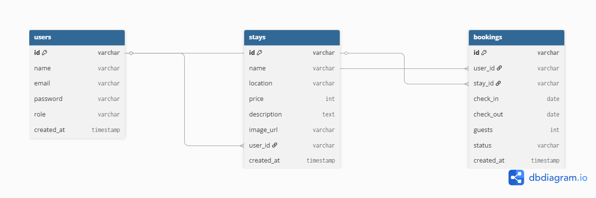

# EcoStay

EcoStay is a full-stack eco-tourism and homestay booking platform built using React, Vite, Tailwind CSS, Node.js, Express, and MongoDB.
It allows users to create, read, update, delete, and search eco stays.

## Features

* Responsive Navbar
* Hero Section with CTA Button
* Reusable Card Components
* About Page
* Contact Page
* Advanced Booking Form
* Phone Number Validation
* Date Validation
* Booking Confirmation System
* Footer with Social Links
* Responsive Design

## Destinations

* Nainital
* Mussoorie
* Auli
* Ranikhet
* Chopta
* Munsiyari
* Lansdowne
* Kausani

## Tech Stack

* React.js
* Vite
* Tailwind CSS
* React Router DOM

## Installation

```bash
npm install
npm run dev
```
## Frontend

*Responsive Navbar
*Hero Section with CTA
*Reusable Card Components
*Search Functionality
*Add Stay Form
*Edit Stay Modal
*Delete Stay Button
*Responsive UI (Tailwind CSS)

## Backend
*REST API using Express.js
*MongoDB database integration
*Full CRUD operations
*Search API endpoint
*Responsive Navbar
*Hero Section with CTA
*Reusable Card Components
*Search Functionality
*Add Stay Form
*Edit Stay Modal
*Delete Stay Button
*Responsive UI (Tailwind CSS)

## Database Schema
Stay Model (MongoDB / Mongoose)


{

  name: String,
  
  location: String,
  
  price: Number
}

     
## Tech Stack

# Frontend

React.js,
Vite,
Tailwind CSS,
React Router DOM,

# Backend

Node.js,
Express.js,
MongoDB.
Mongoose,

## API Base URL

http://localhost:5000/api/stays

## Installation

## Clone Repository

git clone https://github.com/your-username/ecostay.git

## Install Frontend

cd frontend

npm install

npm run dev

## Install Backend

cd backend

npm install

npm run dev

## Create .env file in backend:

MONGO_URI=your_mongodb_connection_string

PORT=5000

## Database Schema



## Author

Bhawana Chand
